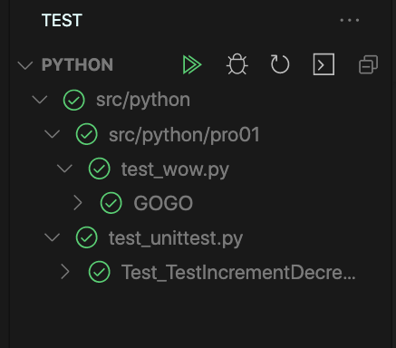
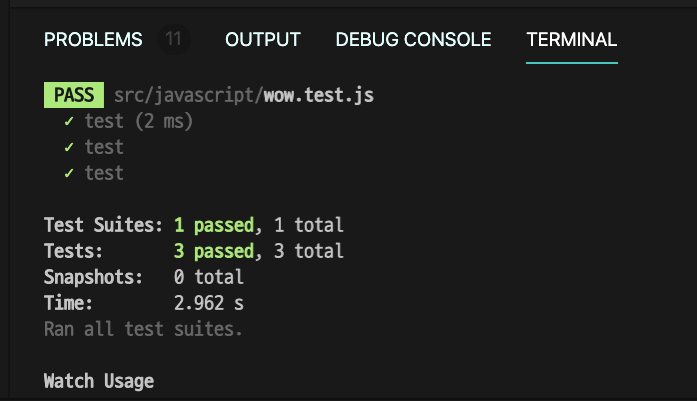
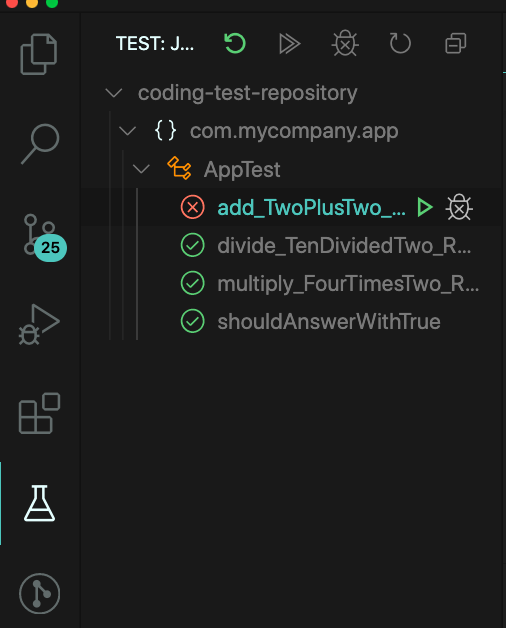
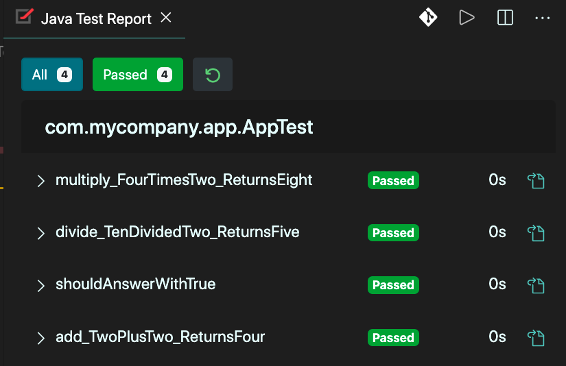

# 코딩 테스트

<code></code>
<code></code>
<code></code>
<code></code>

## Rules

- 모든 코드에는 테스트 코드가 존재해야한다. (TDD 할 수 있으면 해본다)

- 새로 알게된 인사이트는 리드미에 작성하도록 한다.

- 문제를 풀고 꼭 회고를 한다. (다른 방법으로 해결할 수 있는지, 좋은 코드인지 등)

## Problems Index

- 대기

## Test

모든 환경은 MacOS Catalina 버전을 사용

### Python

테스트 프레임워크 : unittest

> unittest, pytest 중 unittest를 사용 (둘다 python에 내장 되어있음, junit에 영향을 받았다고 해서 선택함)

#### Assert

- assertEqual(a, b) / a == b
- assertNotEqual(a, b) / a != b
- assertTrue(x) / bool(x) is True
- assertFalse(x) /bool(x) is False
- assertIs(a, b) / a is b
- assertIsNot(a, b) / a is not b
- assertIsNone(x) / x is None
- assertIsNotNone(x) / x is not None
- assertIn(a, b) / a in b
- assertNotIn(a, b) / a not in b
- assertIsInstance(a, b) / isinstance(a, b)
- assertNotIsInstance(a, b) / not isinstance(a, b)

[unittest](https://docs.python.org/ko/3/library/unittest.html)

#### Required

- VSC에서 test framework를 활성화 시켜야함
- 꼭 테스트 파일이 있는 곳엔 비어있는 `__init__.py` 파일이 존재해야함

#### Referance

- [비주얼 스튜디오 코드에서 파이썬 테스팅하기](https://code.visualstudio.com/docs/python/testing)

- `find . | grep -E "(__pycache__|\.pyc|\.pyo$)" | xargs rm -rf` : 캐시 파일 삭제하기

### Javascript

테스트 프레임워크 : Jest

자바 버전 : Open JDK 14

#### Required

1. `npm install`를 사용하여 jest설치 및 관련된 노드 패키지 다운로드
2. `npm run watch:all` 명령어를 통해 실시간으로 테스트하기

### Java

테스트 프레임워크 : junit

java test report를 통해서 UI적으로 테스트 결과를 볼 수 있음

#### Required

- 처음 저장소를 클론 할 경우, `mvn install`을 실행하여 의존성 다운받기
- `maven`이 설치 되어있어야함, maven이 설치되어있는지 `mvn --version` 으로 확인 할 것
